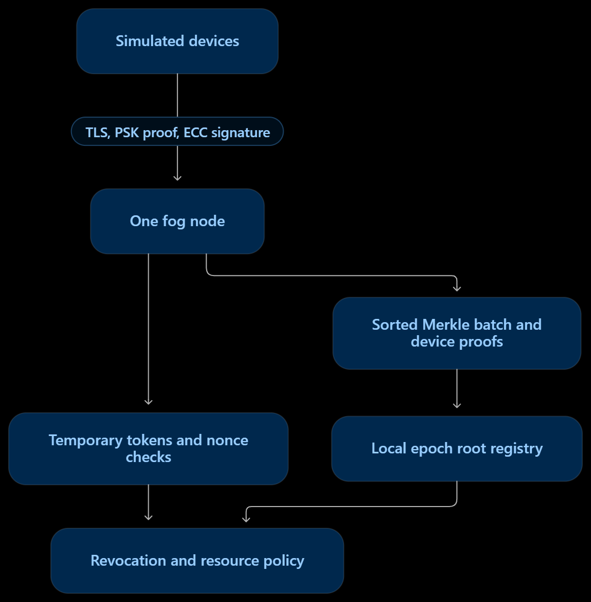

# Single-Zone IIoT Identity Framework

This is a Python simulation of **one IIoT zone, one fog node, and several devices**. A device first proves that it knows its provisioned secret and owns its ECC private key. While it waits for a batch proof, it can use a short-lived fog-signed token with limited permissions. After the batch closes, the fog checks a Merkle proof, a fresh device signature, revocation status, and the resource policy before granting access.

The main demonstration uses **five simulated devices** and a real TLS connection over `127.0.0.1` on the same computer. It does not need Linux, a virtual machine, or external network devices.

## Architecture


The fog is the trusted point for PSK provisioning, device roles, token signing, roots, and revocation. The DID and public key are combined in the leaf `SHA256(DID || public_key)`. The implementation uses ECC P-256 signatures, SHA-256, PSK HMAC-SHA-256 for the network login, and TLS for the localhost device-to-fog connection.

## Setup on Windows

Use PowerShell in the repository folder. Python 3.13 and Git for Windows are suitable.

```powershell
py -m venv .venv
.\.venv\Scripts\python.exe -m pip install -r .\requirements.txt
```

`requirements.txt` should contain `cryptography==50.0.1` and `matplotlib==3.10.8`. You do not have to activate the virtual environment when you call its Python executable directly.

## Quick demonstration

Run this first for a complete protected device-to-fog flow:

```powershell
.\.venv\Scripts\python.exe .\protected_connection.py
```

Expected lines include a denied wrong PSK, five successful registrations, the negotiated TLS version, an allowed temporary sensor write, one stored batch root, an allowed permanent motor `STOP`, and a denied sensor `STOP`.

Other demonstrations show the individual parts and attack checks:

```powershell
.\.venv\Scripts\python.exe .\registry.py
.\.venv\Scripts\python.exe .\access.py
.\.venv\Scripts\python.exe .\signed_access.py
.\.venv\Scripts\python.exe .\revocation.py
.\.venv\Scripts\python.exe .\temporary_token.py
```

You can rerun the demonstrations. Each completed batch receives a new epoch number in `runtime/roots.json`, and the corresponding inclusion proofs go in `runtime/proofs.json`. Revoked devices and tokens are recorded under `runtime/`. That directory is local runtime state and is excluded from Git.

## What each file does

| File | Purpose |
| --- | --- |
| `step1_identity.py` | Device DID and ECC key generation; PSK check and fresh ECC challenge. |
| `batch.py` | Deterministically sort leaves, make one Merkle root, create and verify inclusion proofs. |
| `registry.py` | Save roots and device proofs by epoch. Old roots remain available. |
| `access.py` | Check Merkle membership, trusted fog role, revocation, and resource permission. |
| `signed_access.py` | Require a fresh nonce and device signature for permanent requests. |
| `revocation.py` | Deny a revoked device immediately and exclude it from the next active batch. |
| `temporary_token.py` | Sign short-lived provisional tokens, enforce limited policy, and reject stolen, replayed, expired, changed, or revoked tokens. |
| `protected_connection.py` | Run five device registrations plus temporary and permanent requests across locally verified TLS. |
| `performance.py` | Measure five device counts, repeat trials, write raw/mean CSV results, and generate graphs. |

## Security demonstrations

Run `temporary_token.py`, `signed_access.py`, `revocation.py`, and `access.py` to show the checks below. Read the `ALLOW`/`DENY` reason printed on each line.

| Attempt | File | Fog check and expected result |
| --- | --- | --- |
| Replay an identical request | `signed_access.py`, `temporary_token.py` | Used nonce → `DENY`. |
| Copy a valid token or proof to another device | `temporary_token.py`, `signed_access.py` | The other private key cannot make the expected signature → `DENY`. |
| Change the DID or token role | `access.py`, `temporary_token.py` | Merkle root or fog signature no longer matches → `DENY`. |
| Use an expired or revoked token | `temporary_token.py` | Current expiry or revocation check → `DENY`. |
| Use an old proof after device revocation | `revocation.py` | Old proof can still verify, but current access is `DENY`. |
| Sensor attempts to stop production | `access.py`, `protected_connection.py` | Identity can be valid while policy still says `DENY`. |

## Performance results

```powershell
.\.venv\Scripts\python.exe .\performance.py
```

By default, the benchmark measures **5, 10, 25, 50, and 100 devices**, with **five trials** at each size. It calculates an average from the trials. Each trial verifies every proof 100 times for a more stable latency measurement and makes 30 temporary and 30 permanent signed requests. It reports registration time, batch sorting/tree time, proof generation, verification time, temporary request time, resource access time, and registration/verification throughput.

Files written to `results/`:

- `raw_measurements.csv`: every trial and metric.
- `summary.csv`: mean results for each device count.
- `01_batch_registration.png`: device count against onboarding plus batch and proof time.
- `02_verification_latency.png`: device count against time per verified proof.
- `03_throughput.png`: device count against verified proofs per second.
- `04_batch_vs_individual.png`: one batch tree build compared with rebuilding after every arrival.

The individual comparison measures **repeated sorting and tree construction only**. It does not add the work of updating old proofs or anchoring each new root, so it is a conservative comparison. Results depend on the computer and background load; generate the submitted results on the computer used for the report.

## Demo order for a 10–15 minute presentation

1. Show `protected_connection.py`: verified TLS, wrong PSK denied, five devices registered, leaves, and one root.
2. Show `temporary_token.py`: waiting device allowed limited access; stolen, replayed, expired, and revoked token denied.
3. Show `access.py` and `signed_access.py`: valid proof plus device signature allowed; valid identity with forbidden action denied.
4. Show `revocation.py`: historical proof passes, current signed access denied, revoked device excluded from next epoch.
5. Show `results/summary.csv` and at least the first three graphs; explain the batch-vs-individual graph.

All three students should speak and be able to explain what check causes each rejection.

## Scope and design choices

- The root registry is a trusted local JSON file. This assignment's single-zone implementation does not run a blockchain or coordinate multiple fog nodes.
- The TLS demonstration runs on localhost. It creates a temporary local certificate authority for each run and gives its certificate to the simulated clients in the same process. A deployment across machines would need a securely provisioned, persistent trust anchor and fog signing key.
- Device keys are generated for each run and kept in process for that demonstration. Old proof records remain in the registry, but their private keys are not persisted.
- Resource roles come from fog provisioning records. A requester cannot gain a stronger role by changing the submitted package.

## Team contributions

Fill in actual names and work before submission. Git commits and demonstration participation should match the table.

| Student | Components and files | Tests demonstrated |
| --- | --- | --- |
| [Name 1] | [Actual contributions] | [Tests] |
| [Name 2] | [Actual contributions] | [Tests] |
| [Name 3] | [Actual contributions] | [Tests] |
